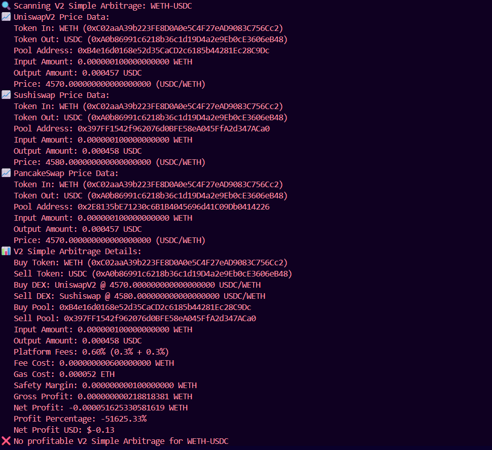
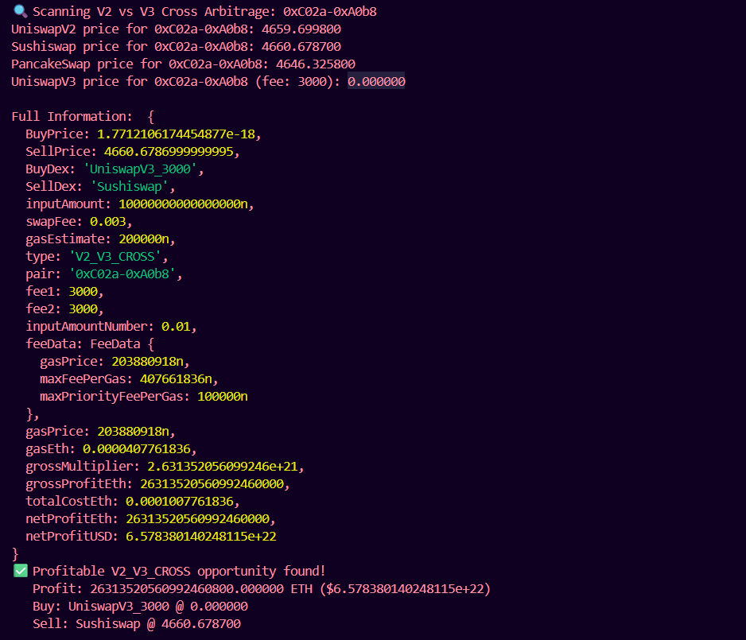
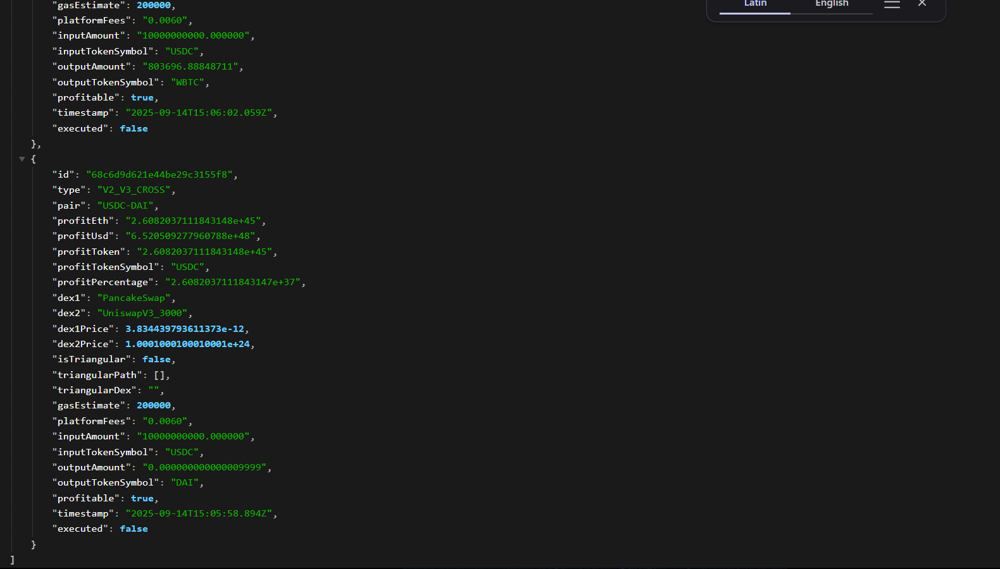

# DeFi Arbitrage Trading Bot (Node.js)
This is a backend service for a decentralized finance (DeFi) arbitrage trading bot built with Node.js, designed to identify and simulate arbitrage opportunities across multiple decentralized exchanges (DEXs): Uniswap V2, Sushiswap V2, PancakeSwap V2, Uniswap V3, Sushiswap V3, and PancakeSwap V3. The bot fetches real-time token prices using a WebSocket provider, detects simple and triangular arbitrage opportunities for both V2 and V3 protocols, calculates net profits, stores results in a MongoDB database, and exposes a REST API to retrieve recent opportunities. The bot operates in simulation mode, meaning no actual on-chain trades are executed.

## Fetch Information
- **Scaning V2 Simple Arbitrage**

- **Scaning V2 or V3 Cross Arbitrage**

- **Opportunities founded**       


## Features

- **Real-time Price Fetching**: Retrieves token prices from Uniswap V2, Sushiswap V2, PancakeSwap V2, Uniswap V3, Sushiswap V3, and PancakeSwap V3 using WebSocket-based RPC calls to query liquidity pool reserves and quoter contracts.
- **Simple Arbitrage Detection**: 
    - V2 Single: Identifies price discrepancies for token pairs (e.g., WETH/USDC, WETH/DAI) across Uniswap V2, Sushiswap V2, and PancakeSwap V2.
    - V3 Single: Compares prices across Uniswap V3, Sushiswap V3, and PancakeSwap V3 for a given fee tier (0.3% or 1% for AAVE-COMP).
    - V2 vs V3 Single: Detects opportunities between V2 (Uniswap V2/Sushiswap) and V3 poolsDetects opportunities between V2 (Uniswap V2/Sushiswap/PancakeSwap) and V3 (Uniswap V3/Sushiswap V3/PancakeSwap V3) pools.
- **Triangular Arbitrage Detection (Bonus)**:
    - V2 Triangular: Detects profitable cycles (e.g., WETH → USDC → DAI → WETH) on Uniswap V2, Sushiswap V2, or PancakeSwap V2.
    - V3 Triangular: Detects profitable cycles across Uniswap V3, Sushiswap V3, and PancakeSwap V3, evaluating all possible exchange combinations (e.g., Uniswap V3 → Sushiswap V3 → PancakeSwap V3).
- **Profit Calculation**: Computes net profit after accounting for swap fees (0.3% for most pairs, 1% for AAVE-COMP), gas costs (200k for simple, 300k for triangular), and a 0.1% safety margin for slippage/volatility.
- **Trade Simulation**: Simulates trades using V2's constant product formula and V3's quoter contracts without executing on-chain transactions.
- **Data Storage**: Stores arbitrage opportunities in MongoDB with fields like timestamp, pair, profit, DEXes, and type (e.g., V2_SIMPLE, V3_TRIANGULAR).
- **REST API**: Provides an endpoint (/opportunities) to fetch recent opportunities, sorted by timestamp.
- **Polling**: Runs checks every 30 seconds using node-cron.

## Prerequisites

**Node.js**: Version 18 or higher.
**MongoDB**: Local instance (e.g., via mongod) or a cloud service like MongoDB Atlas.
**Ethereum WebSocket RPC Endpoint**: Free WebSocket provider (e.g., wss://main-light.eth.linkpool.io/ws from Infura).
**NPM**: For dependency installation.

## Project Structure
```bash
arbitrage-bot/
   ├── app.js                    # Entry point: Express server, cron scheduler, and MongoDB integration
   ├── arbitrageDetector.js      # Arbitrage detection logic (V2 and V3, simple and triangular)
   ├── fetchers/
   │   ├── priceFetcherV2.js     # Price fetching for Uniswap V2, Sushiswap V2, and PancakeSwap V2
   │   └── priceFetcherV3.js     # Price fetching for Uniswap V3, Sushiswap V3, and PancakeSwap V3
   ├── providers/
   │   └── websocketProvider.js  # WebSocket provider setup
   ├── config/
   │   └── validPairs.js         # Token definitions, trading pairs, and pool addresses
   └── models/
       └── Opportunity.js        # Mongoose schema for storing arbitrage opportunities
   ├── .env                          # Environment variables (WS_RPC_URL, MONGO_URI, PORT)
   ├── package.json                  # Node.js dependencies and scripts
   ├── images/                       # Screenshots for README (1.png, 2.png, 3.png)
   └── README.md                     # Project documentation
```

## Setup Instructions

- Clone or Create the Project:
```bash
git clone "https://github.com/Ashishk279/DeFi-Arbitrage-Trading-Bot.git"
cd DeFi-Arbitrage-Trading-Bot
```


- Install Dependencies:
```bash
npm install
```


- Configure Environment Variables:
```bash
Copy .env.example to .env:cp .env.example .env
```

-Edit .env with:
WS_RPC_URL: WebSocket RPC endpoint (e.g., wss://main-light.eth.linkpool.io/ws).
MONGO_URI: MongoDB connection string (e.g., mongodb://localhost:27017/arb_bot or Atlas URI).
PORT: Optional (defaults to 3000).Example .env:
```bash
WS_RPC_URL=wss://main-light.eth.linkpool.io/ws
MONGO_URI=mongodb://localhost:27017/arb_bot
PORT=3000
```


- Set Up MongoDB:

Local: Run mongod (ensure MongoDB is installed).
Cloud: Use MongoDB Atlas and update MONGO_URI.


- Run the Bot:
```bash
npm start
```

- Starts the Express server on http://localhost:3000.
- Polls for arbitrage opportunities every 30 seconds.
- Logs scan results to console (e.g., prices, profits, DEX combinations).
- Stores opportunities in MongoDB.


- Test the API:
```bash
Fetch recent opportunities:curl http://localhost:3000/opportunities?limit=5


Response example:[
  {
    "id": "67123abcde1234567890abcd",
    "timestamp": "2025-09-11T12:34:56Z",
    "pair": "WETH-USDC",
    "profitEth": 0.015,
    "isTriangular": false,
    "trianglePairs": ""
  },
  ...
]

```


## Development/Testing:

- Use a testnet (e.g., Goerli) by updating RPC_URL and contract addresses in priceFetcher.js.
- Use a local Ethereum fork (e.g., Anvil from Foundry) for simulation.
- Query MongoDB (arb_bot database, opportunities collection) to verify stored data.


## Dependencies

**ethers**: For Ethereum blockchain interactions (v6.13.2).
**express**: For REST API (v4.19.2).
**mongoose**: For MongoDB interaction (v8.6.0).
**node-cron**: For scheduled polling (v3.0.3).
**dotenv**: For environment variable management (v16.4.5).
**@uniswap/sdk-core**: For Uniswap token definitions (v5.0.0).
**@uniswap/v3-sdk**: For Uniswap V3 pool interactions (v3.9.0).

## Logic and Calculations
**Price Fetching**

- V2 (Uniswap V2, Sushiswap V2, PancakeSwap V2)**: 
  - Mechanism: Uses ethers.js to call getReserves on pair contracts via the factory. 
  Price is calculated as: 
```bash
amountOut = (amountIn * 997 * reserveOut) / (reserveIn * 1000 + amountIn * 997)

```
  where 997/1000 accounts for the 0.3% swap fee. 
    - Inputs: Default input is 0.01 WETH (10^16 wei). Output is normalized for token decimals.
- V3 (Uniswap V3, Sushiswap V3, PancakeSwap V3):
  - Mechanism: Uses quoteExactInputSingle for single-hop prices and quoteExactInput for multi-hop paths via quoter contracts (e.g., Uniswap V3 QuoterV2 at 0x61fFE014bA17989E743c5F6cB21bF9697530B21e).
  - Inputs: 0.01 WETH (10^16 wei) or 100 units of input token (adjusted for decimals < 15).
  - Fee Tiers: Uses 0.3% (3000) for most pairs, 1% (10000) for AAVE-COMP.

**Simple Arbitrage Detection**
- V2 Simple:

  - Compares prices for a pair (e.g., WETH/USDC) across Uniswap V2, Sushiswap V2, and PancakeSwap V2.
  - Example: Buy on Uniswap V2, sell on Sushiswap V2.


- V3 Simple:

  - Compares prices across Uniswap V3, Sushiswap V3, and PancakeSwap V3 for the same fee tier (0.3% or 1%).
  - Example: Buy on Uniswap V3, sell on PancakeSwap V3.


- V2 vs V3 Cross:

  - Compares prices between V2 (Uniswap V2/Sushiswap/PancakeSwap) and V3 (Uniswap V3/Sushiswap V3/PancakeSwap V3).
  - Example: Buy on Sushiswap V2, sell on Uniswap V3.


- Profit Calculation:

  - **Gross profit**: input * (sellPrice / buyPrice - 1).
  - **Swap fees**: input * fee * 2 (two trades, fee = 0.003 or 0.01 for AAVE-COMP).
  - **Gas cost**: (feeData.gasPrice * 200,000) / 10^18 ETH.
  - **Safety margin**: input * 0.001.
  - **Net profit**: gross - swapFees - gasCost - safetyMargin.
  - Store if **netProfit** > 0.


**Triangular Arbitrage Detection**

- V2 Triangular:

  - Simulates a cycle (e.g., WETH → USDC → DAI → WETH) on a single V2 DEX using getAmountsOut from the router contract.


- V3 Triangular:

  - Simulates cycles across Uniswap V3, Sushiswap V3, and PancakeSwap V3, testing all combinations (e.g., Uniswap V3 → Sushiswap V3 → PancakeSwap V3).
  - Uses quoteExactInput for multi-hop paths with specified fee tiers (0.3% or 1% for AAVE-COMP).


- Triangles: Includes paths like WETH → USDC → DAI → WETH, WETH → USDC → WBTC → WETH, and WETH → AAVE → COMP → WETH.
Profit Calculation:

  - **Gross profit**: amountBack - input.
  - **Swap fees**: input * fee * 3 (three trades, fee = 0.003 or 0.01 per hop).
  - **Gas cost**: (feeData.gasPrice * 300,000) / 10^18 ETH.
  - **Safety margin**: input * 0.001.
  - **Net profit**: gross - swapFees - gasCost - safetyMargin.
  - Store if **netProfit** > 0.


## Data Storage

- MongoDB Schema: Stores opportunities in the opportunities collection with fields: timestamp, pair, dex1, dex1Price, dex2, dex2Price, profitEth, profitUsd, isTriangular, triangularPath, triangularDex, type, fees.
- Types: V2_SIMPLE, V3_SIMPLE, V2_V3_CROSS, V2_TRIANGULAR, V3_TRIANGULAR.

## API

- Endpoint: GET /opportunities?limit=N (default N=10).
- Response: Array of opportunities, sorted by timestamp (descending).
- Fields: _id, timestamp, pair, profitEth, profitUsd, isTriangular, triangularPath, triangularDex, type, fees.

## Polling

- Scheduler: node-cron runs scanAllOpportunities every 30 seconds.
- Process: Fetches prices, detects opportunities (V2 simple, V3 simple, V2 vs V3, V2 triangular, V3 triangular), stores results in MongoDB, and logs details (e.g., DEX combinations, profits).

## Limitations and Potential Improvements

- Scope: Supports 13 trading pairs (e.g., WETH/USDC, AAVE/COMP) and 5 triangular paths. Expand by adding more pairs/triangles in validPairs.js.
Pool Addresses: Some Sushiswap V3 and PancakeSwap V3 addresses are placeholders. Replace with actual mainnet addresses from DEX factories or explorers.
- Precision: Uses BigInt for calculations, but MongoDB stores profitEth as Number. Use Decimal128 for high-precision storage if needed.
Error Handling: Includes basic retries for RPC failures. Add exponential backoff for WebSocket reconnects in websocketProvider.js.
Performance: Sequential price fetching. Optimize with parallel requests or WebSocket event listeners for real-time price updates (e.g., subscribe to pool events).
- Real Trading: Simulation-only. For real trades, integrate a wallet, flash loans, and MEV protection (requires private keys and advanced setup).
- Slippage: Approximated with a 0.1% safety margin. Implement dynamic slippage modeling based on pool liquidity and trade size.
- Scalability: Add more DEXs (e.g., Curve, Balancer) or dynamic pair discovery via factory contracts.
- WebSocket Stability: Monitor WebSocket connection in websocketProvider.js and implement reconnection logic for production.
ETH Price: Uses static 2500 USD in arbitrageDetector.js. Integrate a price feed (e.g., Chainlink) for dynamic ETH/USD conversion.

## Troubleshooting

- MongoDB Connection Errors: Verify MONGO_URI in .env and ensure MongoDB is running (local or cloud). Check Atlas whitelist if using cloud.
- WebSocket RPC Errors: Confirm WS_RPC_URL is valid and reachable. 
- No Opportunities Found: Common in stable markets. Increase INPUT_AMOUNT in arbitrageDetector.js (e.g., 0.01 ETH to 0.1 ETH) or add volatile pairs (e.g., WETH/UNI).
- API Issues: Ensure the server is running (npm start) and the port (default 3000) is not blocked. Check firewall settings.
- TypeError: provider.getGasPrice is not a function: Fixed by using provider.getFeeData().gasPrice (ethers.js v6).
- Invalid Pool Addresses: Verify pool addresses in validPairs.js. Replace placeholder Sushiswap V3/PancakeSwap V3 addresses with mainnet addresses from DEX factories.
- Module Import Errors: Ensure package.json includes "type": "module" and all files use ES modules consistently.

## Notes

- Testnet Usage: For development, use Sepolia or a local fork. Update pool addresses in validPairs.js for testnet contracts.
- Security: Never store private keys; this is simulation-only.
Extensibility: Add more tokens (e.g., LINK, MKR) or triangular paths in validPairs.js. Implement graph-based cycle detection for dynamic triangular arbitrage.
- Monitoring: Add logging (e.g., Winston) or metrics (e.g., Prometheus) for production monitoring.
- V3 Fee Tiers: Uses 0.3% (3000) for most pairs and 1% (10000) for AAVE-COMP. Adjust in validPairs.js if other tiers are needed.

For further details, refer to inline code comments or contact the developer.