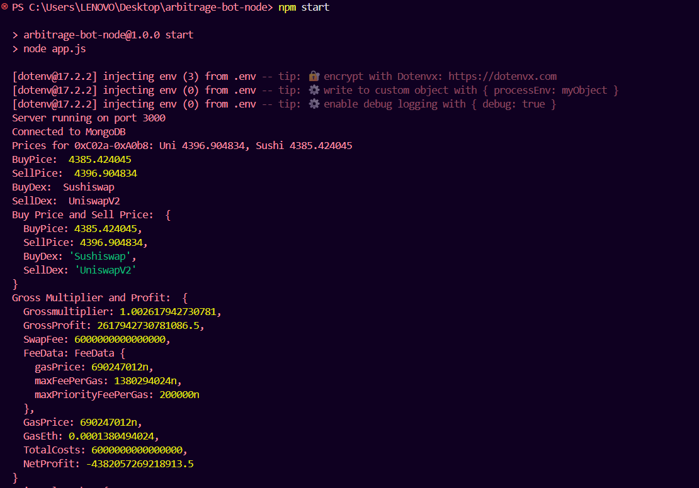
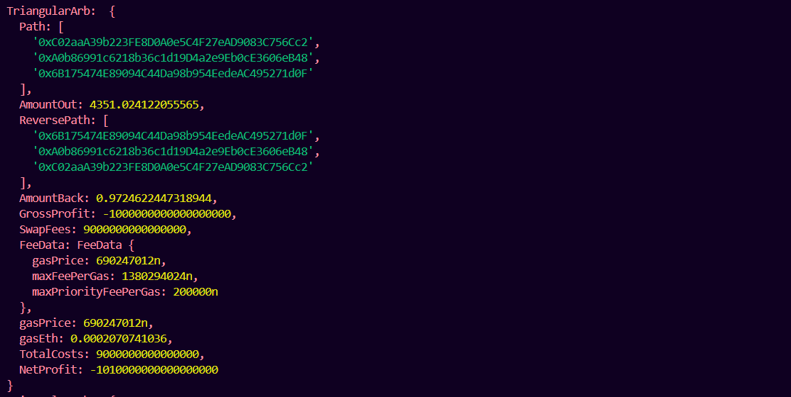
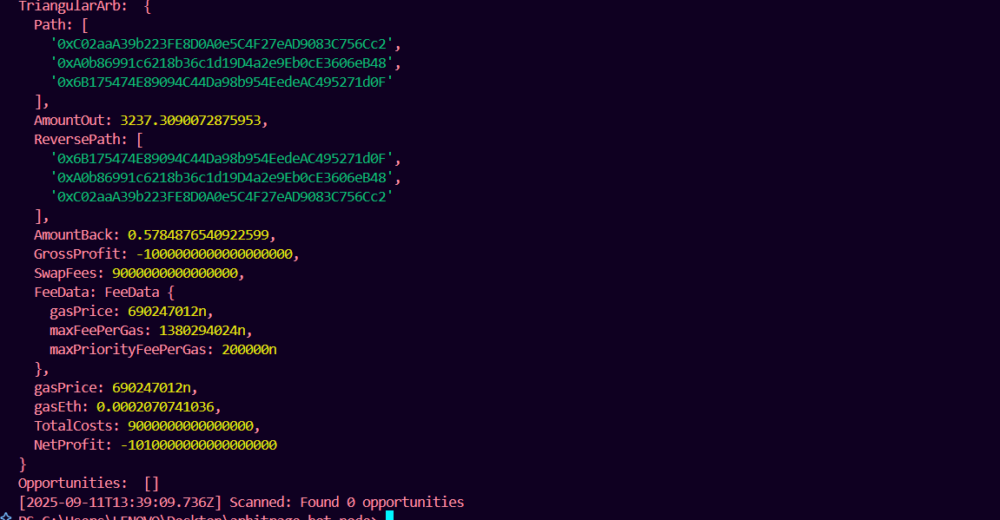

# DeFi Arbitrage Trading Bot (Node.js)
This is a backend service for a decentralized finance (DeFi) arbitrage trading bot built with Node.js, designed to identify and simulate arbitrage opportunities across Uniswap V2-compatible decentralized exchanges (DEXs). It fetches real-time token prices, detects simple and triangular arbitrage opportunities, calculates potential profits, stores results in a MongoDB database, and exposes an API to retrieve recent opportunities. The bot operates in simulation mode, meaning no actual on-chain trades are executed.

## Fetch Information
- **Buy Price And Sell Price**

- **Triangular Arbitrage**

- **Opportunities**


## Features

- **Real-time Price Fetching**: Retrieves token prices from Uniswap V2 and Sushiswap by querying liquidity pool reserves.
- **Simple Arbitrage Detection**: Identifies price discrepancies for the same token pair (e.g., WETH/USDC) across two DEXs where the profit exceeds swap fees (0.3% per trade) and estimated gas costs.
- **Triangular Arbitrage Detection (Bonus)**: Detects profitable cycles across three token pairs on a single DEX (e.g., WETH → USDC → DAI → WETH).
- **Profit Calculation**: Computes net profit after accounting for swap fees, gas costs, and a safety margin (0.1% buffer for slippage/volatility).
- **Trade Simulation**: Simulates trade execution using Uniswap V2's constant product formula without sending transactions.
- **Data Storage**: Stores arbitrage opportunities in MongoDB with details like timestamp, pair, prices, and profit.
- **REST API**: Provides an endpoint (/opportunities) to fetch recent opportunities, sorted by timestamp.
- **Polling**: Runs checks every 30 seconds using node-cron.

## Prerequisites

**Node.js**: Version 18 or higher.
**MongoDB**: Local instance (e.g., via mongod) or a cloud service like MongoDB Atlas.
**Ethereum RPC Endpoint**: Free tier from providers like Infura or Alchemy (mainnet or testnet).
**NPM**: For dependency installation.

## Project Structure
```bash
arbitrage-bot-node/
├── app.js               # Entry point: API server and polling scheduler
├── priceFetcher.js      # Logic for fetching prices from DEXs
├── arbDetector.js       # Arbitrage detection (simple and triangular)
├── models/
│   └── Opportunity.js   # Mongoose schema for storing opportunities
├── .env.example         # Template for environment variables
├── package.json         # Node.js dependencies and scripts
└── README.md            # Project documentation
```

## Setup Instructions

- Clone or Create the Project:
```bash
git clone "https://github.com/Ashishk279/DeFi-Arbitrage-Trading-Bot.git"
cd DeFi-Arbitrage-Trading-Bot
```


- Install Dependencies:
```bash
npm install
```


- Configure Environment Variables:
```bash
Copy .env.example to .env:cp .env.example .env
```

-Edit .env with:
RPC_URL: Your Ethereum RPC endpoint (e.g., https://mainnet.infura.io/v3/YOUR_INFURA_KEY).
MONGO_URI: MongoDB connection string (e.g., mongodb://localhost:27017/arb_bot or Atlas URI).
PORT: Optional (defaults to 3000).Example .env:
```bash
RPC_URL=https://mainnet.infura.io/v3/YOUR_INFURA_KEY
MONGO_URI=mongodb://localhost:27017/arb_bot
PORT=3000
```


- Set Up MongoDB:

Local: Run mongod (ensure MongoDB is installed).
Cloud: Use MongoDB Atlas and update MONGO_URI.


- Run the Bot:
```bash
npm start
```


Starts the Express server on http://localhost:3000.
Polls for arbitrage opportunities every 30 seconds.
Logs scan results to console.
Stores opportunities in MongoDB.


- Test the API:
```bash
Fetch recent opportunities:curl http://localhost:3000/opportunities?limit=5


Response example:[
  {
    "id": "67123abcde1234567890abcd",
    "timestamp": "2025-09-11T12:34:56Z",
    "pair": "WETH-USDC",
    "profitEth": 0.015,
    "isTriangular": false,
    "trianglePairs": ""
  },
  ...
]

```


## Development/Testing:

Use a testnet (e.g., Goerli) by updating RPC_URL and contract addresses in priceFetcher.js.
Use a local Ethereum fork (e.g., Anvil from Foundry) for simulation.
Query MongoDB (arb_bot database, opportunities collection) to verify stored data.


## Dependencies

**ethers**: For Ethereum blockchain interactions (v6.13.2).
**express**: For REST API (v4.19.2).
**mongoose**: For MongoDB interaction (v8.6.0).
**node-cron**: For scheduled polling (v3.0.3).
**dotenv**: For environment variable management (v16.4.5).

## Logic and Calculations
**Price Fetching**

Mechanism: Uses ethers.js to call getReserves on Uniswap V2 pair contracts (via factory). For a pair (e.g., WETH/USDC), price is calculated as:amountOut = (amountIn * 997 * reserveOut) / (reserveIn * 1000 + amountIn * 997)

where 997/1000 accounts for the 0.3% swap fee. Prices are normalized for token decimals.
Inputs: Default input is 1 WETH (10^18 wei). Output is in the quote token (e.g., USDC).
DEXs: Uniswap V2 and Sushiswap (mainnet addresses).

**Simple Arbitrage Detection**

Logic: For a pair (e.g., WETH/USDC), compare prices on Uniswap and Sushiswap.
If Uniswap price < Sushiswap price, simulate: Buy on Uniswap, sell on Sushiswap.
If Sushiswap price < Uniswap price, reverse the trade.


**Profit Calculation**:
- Gross profit: input * (sellPrice / buyPrice - 1).
- Swap fees: input * 0.003 * 2 (0.3% per trade, two trades).
- Gas cost: (feeData.gasPrice * 200,000) / 10^18 ETH (estimated for two swaps).
- Safety margin: input * 0.001 (0.1% buffer).
- Net profit: gross - swapFees - gasCost - safetyMargin.
- Store if netProfit > 0.


**Simulation**: Uses getReserves for price approximation; no on-chain execution.

**Triangular** Arbitrage Detection (Bonus)

**Logic**: On a single DEX, simulate a cycle (e.g., WETH → USDC → DAI → WETH) using getAmountsOut from the router contract.
Check if final amount (WETH back) > initial input after fees.
**Triangle**: [WETH, USDC, DAI] (hardcoded for simplicity).


**Profit Calculation**:
- Gross profit: amountBack - input.
- Swap fees: input * 0.003 * 3 (three trades).
- Gas cost: (feeData.gasPrice * 300,000) / 10^18 (1.5x estimate for multi-hop).
- Safety margin: input * 0.001.
- Net profit: gross - swapFees - gasCost - safetyMargin.
- Store if netProfit > 0.


## Data Storage

MongoDB Schema: Stores opportunities with fields: timestamp, pair, dex1, dex1Price, dex2, dex2Price, profitEth, isTriangular, trianglePairs.
Collection: opportunities in arb_bot database.

## API

Endpoint: GET /opportunities?limit=N (default N=10).
Response: Array of opportunities, sorted by timestamp (descending).
Fields: id, timestamp, pair, profitEth, isTriangular, trianglePairs.

## Polling

Scheduler: node-cron runs scanAll every 30 seconds.
Process: Fetches prices, detects opportunities, stores results, logs count.

Limitations and Potential Improvements

Scope: Simulates one pair (WETH/USDC) and one triangle (WETH-USDC-DAI). Expand by adding more pairs/triangles in arbDetector.js.
Precision: BigInt used for calculations, but stored as Number in MongoDB (potential precision loss for large values).
Error Handling: Basic; add retries for RPC failures and validation.
Performance: Single-threaded polling. For production, use WebSocket providers (e.g., Infura WebSocket) or parallelize scans.
Real Trading: Out of scope (simulation-only). For real trades, integrate wallets and flash loans (requires private keys, MEV protection).
Slippage: Not fully modeled; safety margin approximates.
Scalability: Add more DEXs (e.g., PancakeSwap on BSC) or dynamic pair discovery.

## Troubleshooting

MongoDB Connection Errors: Verify MONGO_URI in .env and ensure MongoDB is running (local or cloud).
RPC Errors: Check RPC_URL in .env. Ensure the provider (e.g., Infura) is reachable and not rate-limited. Use a testnet for development.
Error: TypeError: provider.getGasPrice is not a function: Occurs with ethers.js v6, where getGasPrice is replaced by getFeeData. The provided arbDetector.js uses provider.getFeeData().gasPrice to fix this.
Module Import Errors: Ensure package.json includes "type": "module" and all files use ES modules (import/export) consistently.
No Opportunities Found: Normal in stable markets. Test with volatile pairs (e.g., add more in arbDetector.js) or increase INPUT_AMOUNT in arbDetector.js.
API Issues: Ensure the server is running (npm start) and the port (default 3000) is not blocked.

## Notes

Testnet Usage: For development, use Goerli or a local fork (e.g., Anvil). Update contract addresses in priceFetcher.js.
Security: Never store private keys; this is simulation-only.
Extensibility: Add more pairs in arbDetector.js or implement graph-based cycle detection for triangular arbitrage.
Monitoring: Add logging (e.g., Winston) or metrics (e.g., Prometheus) for production.

For further details, refer to inline code comments or contact the developer.